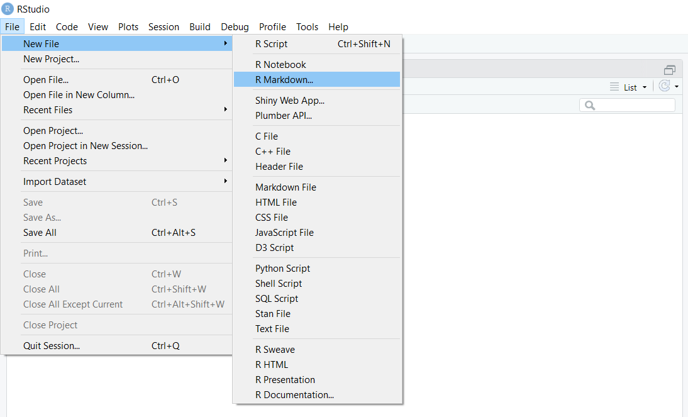
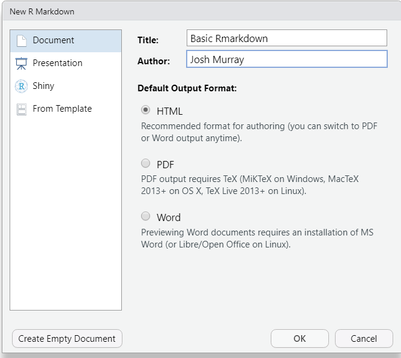
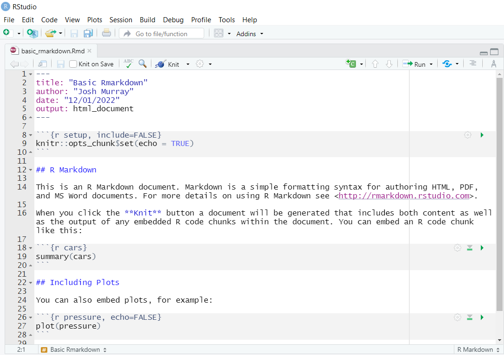
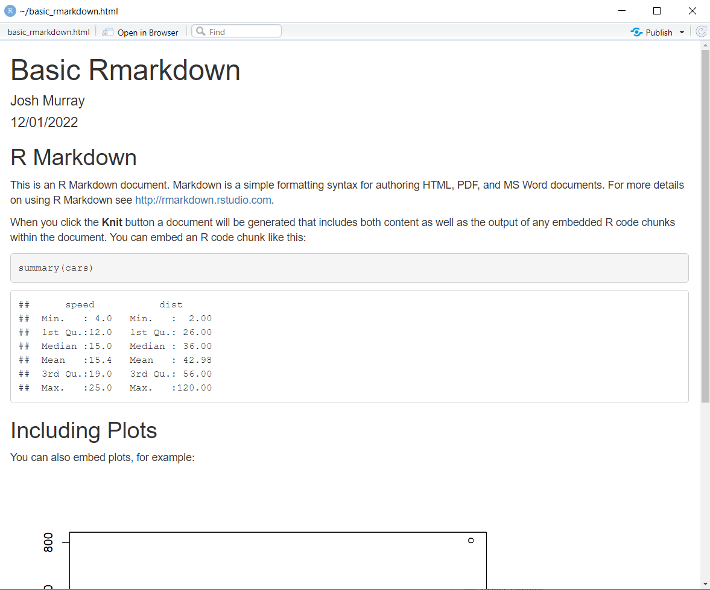
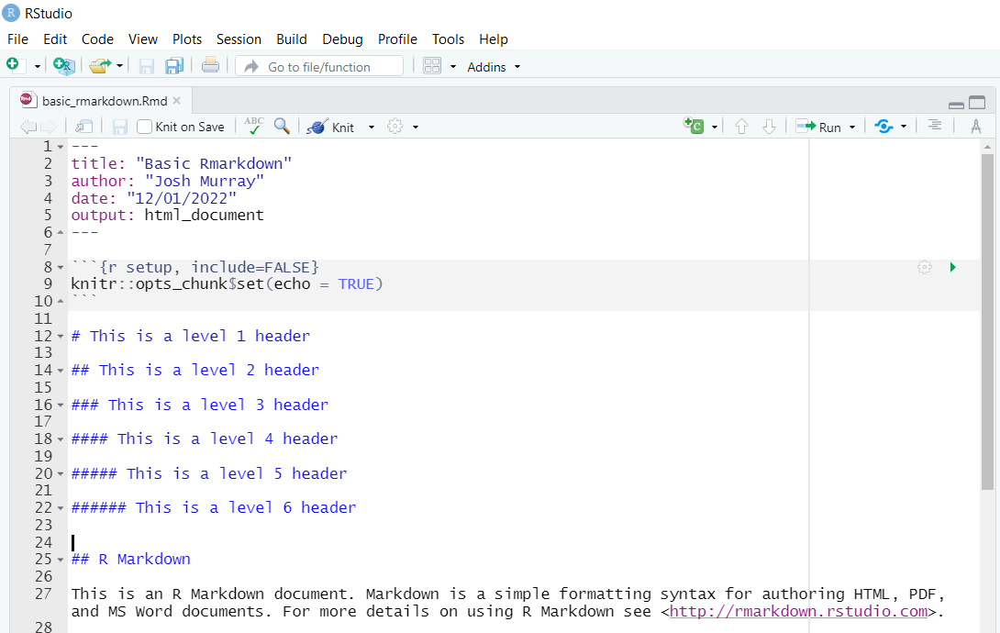

<!-- README.md is generated from README.Rmd. Please edit that file -->

```{r, include = FALSE}
knitr::opts_chunk$set(
  collapse = TRUE,
  comment = "#>"
)
```

# First Tutorial


Welcome to your first tutorial of the semester. 
If you are reading this from an Rstudio session, please open the github repo at () to see a formatted version of this README file.

We are going to cover a few basic concepts to re-familiarize yourself with R (if you aren't already), practice some tidy data concepts, and to get some practice building Rmarkdown documents. 

This repository contains the following documents:

1. `01_simple_r_refresher.Rmd` and `01_simple_r_refresher.html`. 
2. `02_tidy_data_principles.Rmd` and `02_tidy_data_principles.html`
3. `03_parameterized_rmarkdown.Rmd`
4. `automate_reports.R`


## Instructions

Below 

### 1. R Refresher

You can either open `01_simple_r_refresher.html` to see the knitted version of the tutorial, or open `01_simple_r_refresher.Rmd` if you would like to run the commands yourself. I am sure some or all of what is covered will be old news to you, depending on your R comfort level. 


### 2. Creating your first Rmarkdown document

Being comfortable with Rmarkdown documents will be vital for your success in this course since most assessments will involve altering or creating Rmarkdown documents. 


In this section of the tutorial, we will build a simple Rmarkdown document and make a few changes. We will start by creating and knitting the default .rmd file

#### Step 1

From your Rstudio session, go to file -> new -> R markdown...



#### Step 2

A New R Markdown window will open. Enter "Basic Rmarkdown" for the title and your name where it says "author". Leave all the other defaults and click the OK button.




#### Step 3

A new R Markdown file will open in Rstudio. Note that the file is not saved (untitled1)  Click the save icon and name the file `basic_rmarkdown`. When you are done, you should see the following:




#### Step 4

This is a ready made document that can be knitted into an html file. Click the knit button at the top of the file panel as shown below. 


After the file has knitted, you will see the output in a new window




#### Step 5

We will now spend some time editing the document to get comfortable with some markdown syntax. 

The top of the document where there are two hashtags followed by R markdown (i.e. ## R Markdown) is a header. The number of hashtags (#) you include will determine the level of the header. One hashtag (#) is a level 1 header while two hastags (##) is a level 2 header and so on, up to level 6.

Try adding some more headers and then click knit again. Your markdown could look like this




#### Step 6 

Text formatting. Formatting text in Rmarkdown is quite simple. I will provide a few examples here for you to try out. If you are ever having trouble figuring out some text formatting, I find that either having a look through [The Definitive Rmarkdown Guide](https://bookdown.org/yihui/rmarkdown/), or a simple goole will do the trick.

Italics

```
Text to be _italicized_ goes inside _a single set of underscores_ or *asterisks*.  Text to be **boldfaced** goes inside a __double set of underscores__  or **asterisks**.
```

Unordered lists:

```
* Item 1
* Item 2
    + Item 2a
    + Item 2b
```

Ordered lists:

```
1. Item 1
2. Item 2
3. Item 3
    + Item 3a
    + Item 3b
```

html links:

You can include a link in a document as follows

```
http://example.com

[linked phrase](http://example.com)
```


Images:
```


```

Blockquotes:

```
A friend once said:

> It's always better to give
> than to receive.
```

#### Step 7: R chunks

R chunks are the place where we write our R code. The default R markdown document we created already has an R chunk in it

````
```{r, eval=TRUE}`r ''`
  summary(cars)
```
````


R chunks are always between 2 sets of 3 back ticks.

Within the curly braces at the start of the code chunk is where we specify our options. There are many options available to you, but a few of the most important ones are

- `include` = `FALSE` prevents code and results from appearing in the finished file. R Markdown still - runs the code in the chunk, and the results can be used by other chunks.
- `echo` = `FALSE` prevents code, but not the results from appearing in the finished file. This is a - useful way to embed figures.
- `message` = `FALSE` prevents messages that are generated by code from appearing in the finished file.
- `warning` = `FALSE` prevents warnings that are generated by code from appearing in the finished.
- `fig.cap` = "..." adds a caption to graphical results
- `eval` = `FALSE` will not evaluate the code. This can be useful if you want to display some R code without having it run.

In the chunk shown above, no options are provided, however the chunk has a name (cars). Naming a chunk is optional, however all chunk names must be unique. 

You can also set default options for your entire document as follows


````
```{r, }`r ''`
# Set knitr options for knitting code into the report:
# - Don't print out code (echo)
# - Save results so that code blocks aren't re-run unless code changes (cache),
# _or_ a relevant earlier code block changed (autodep), but don't re-run if the
# only thing that changed was the comments (cache.comments)
# - Don't clutter R output with messages or warnings (message, warning)
  # This _will_ leave error messages showing up in the knitted report
knitr::opts_chunk$set(echo=FALSE,
               cache=TRUE, autodep=TRUE, cache.comments=FALSE,
               message=FALSE, warning=FALSE)
```
````
Trial and error is the best way to learn markdown. Try playing around with some of the options in the code chunks in this file. Re-knit each time to see what happens. 

#### conclusion

This should be enough to get you started writing Rmarkdown documents. One last topic that I urge you to have a look at when you have time, is writing mathematical expressions in markdown. The [chapter section from the Definitive guide to Rmarkdown](https://bookdown.org/yihui/rmarkdown/markdown-syntax.html#math-expressions), is an excellent introduction. 


## Parameterized Reports

The last tutorial section will introduce you to parameterized reports, a life changing technique, if you have to write lots and lots of similar Rmarkdown reports. One of the main benefits of using rmarkdown is that you can reproduce an analysis with the simple click of a button. Often times, you will need to rerun an analysis for for different groups within the same dataset, or with different data sets all together. In this section we will get some practice doing just that.

The YAML section at the top of an Rmarkdown document contains information about the author of the document, the name of the document, and the output format among many other options that can be included. You can also include parameters that can be accessed anywhere in the report. 

For example, with the YAML below we are specifying parameters that could be useful in the report. We have specified, an author's name, a year, a region (set to Europe by default), and a data file name. 

```
---
title: "My Parametrized Report"
output: html_document
params:
  author_name: "Your Name"
  year: 2018
  region: "Europe"
  data: "data_file.csv"
---
```

We can access these parameters in the document as `params$year` and `params$region`. 


This is nice enough on its own, however, the real beauty comes in realizing that when you knit documents, you can pass different values for these parameters. 

There are three ways in which a parameterized report can be knitted:

1. Using the `Knit` button within RStudio.

2. `rmarkdown::render()` with the params argument.

3. Using an interactive user interface to input parameter values.

When you use the `knit` button, or call `rmarkdown::render()`, the default values you specify in the YAML metadata will be used. You can pass different parameter values within the `rmarkdown::render()` function, or by clicking on the drop down menu of the knit button, and selecting Knit with parameters. 


For this section of the tutorial I have created an Rmarkdown document for you to play with to get some experience parametrizing your reports. The intention of the report is to display some summary statistics for a given National Basketball Association team (NBA) for the 2020 season. I have included some data in the data folder that has the results of every game for every team for the 2020 season. 

The YAML metadata looks as follows

```
---
title: "My Parametrized Report"
output: html_document
params:
  author_name: "Your Name"
  nameTeam: "Toronto Raptors"
  include_plots: TRUE
  data_filename: "data/nba_results2020.csv"
---
```

You can see that there are 4 parameters, a `author_name`  `nameTeam` `include_plots`, `season_name`, `data_filename`. 
 
#### Step 1
 
 First read the .Rmd file named `03_parameterized_report.Rmd` and see if you can figure out its default behaviour.
 
 
Click on the knit button to see what the default behaviour is. 


#### Step 2

Try changing the nameTeam input value to some other team. Then re-knit the document

Valid values for the nameTeam parameter are:


```{r, echo=F, warning=F, message=F}

df <- readr::read_csv('data/nba_results2020.csv')

print(unique(df$nameTeam))
```


#### Step 3

So far, every time we re-knit the document it overwrites the previous document. What if we want reports for separater teams in separate files. This can be accomplished by using the `rmarkdown::render()` function. Try running the following commmand

```{r, eval=F}
rmarkdown::render("03_parametrized_report.Rmd",
                  params = list(nameTeam="Houston Rockets"),
                  output_file = "reports/Houston Rockets.html")

```

#### Step 4

Excellent, now we can write a function to make all of our reports. Open the file titled `automate_reports.R`. This has a function to run the reports for every team in the data set and output an html file in the reports folder.

Try running this file line by line to see what happens. Then have a look in the reports folder. 


