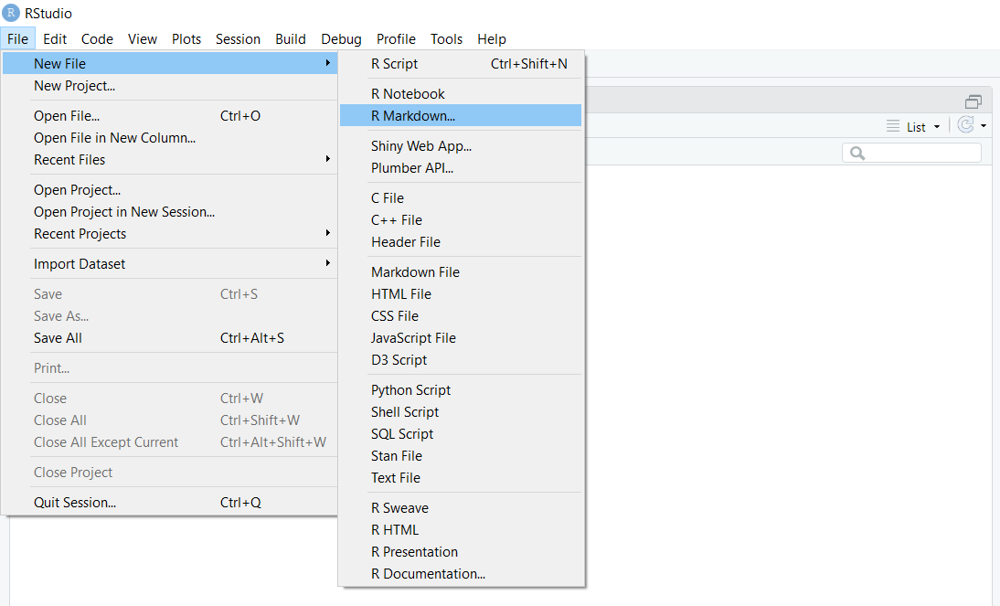

# First Tutorial

Welcome to your first tutorial of the semester. 
If you are reading this from an Rstudio session, please open the github repo at () to see a formatted version of this README file.

We are going to cover a few basic concepts to re-familiarize yourself with R (if you aren't already), practice some tidy data concepts, and to get some practice building Rmarkdown documents. 

This repository contains the following documents:

1. `01_simple_r_refresher.Rmd` and `01_simple_r_refresher.html`. 
2. `02_tidy_data_principles.Rmd` and `02_tidy_data_principles.html`
2. `02_basic_rmarkdown.Rmd`
3. `03_parameterized_rmarkdown.Rmd`

## Instructions

Below 

### R Refresher

You can either open `01_simple_r_refresher.html` to see the knitted version of the tutorial, or open `01_simple_r_refresher.Rmd` if you would like to run the commands yourself. I am sure some or all of what is covered will be old news to you, depending on your R comfort level. 

### Creating your first Rmarkdown document

Being comfortable with Rmarkdown documents will be vital for your success in this course since most assessments will involve altering or creating Rmarkdown documents. 

In this section of the tutorial, we will build a simple Rmarkdown document and make a few changes. We will start by creating and knitting the default .rmd file

#### Step 1

From your Rstudio session, go to file -> new -> R markdown...

